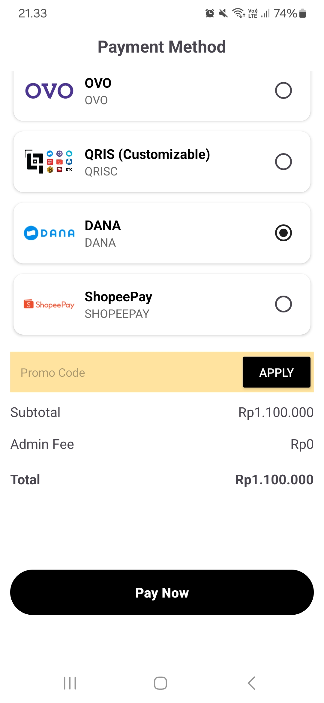
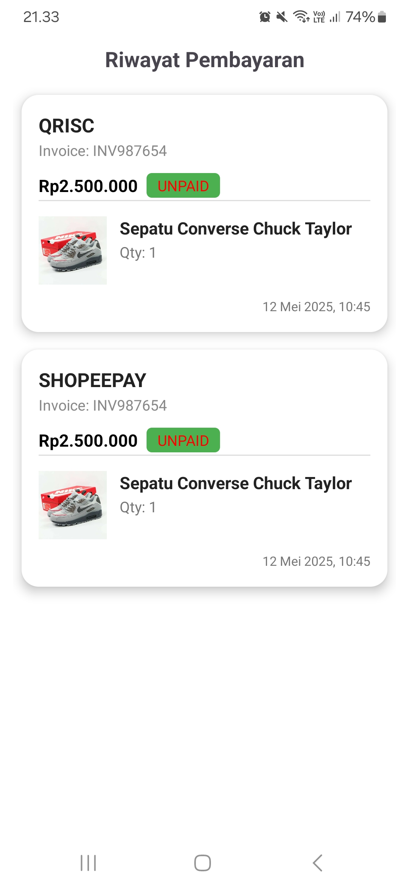

# ShoePay | Online Shoe Store App 👟

A modern Android application built with **Kotlin**, **Firebase**, and **Tripay** payment gateway integration. This project is a simulation of an online shoe store that allows users to register, log in, browse dummy shoe products, and simulate purchases using various e-wallet payment methods such as QRIS, OVO, DANA, and ShopeePay.

---

## ✨ Features

- 🔐 User authentication using **Firebase Auth**
- ☁️ Real-time data with **Cloud Firestore**
- 📱 Simple & responsive UI using **Material Design**
- 📷 QR Code generation for payment using **ZXing**
- 💳 Payment integration via **Tripay API** (supports QRIS, OVO, DANA, ShopeePay)
- 📦 Dummy data for product listings (shoes)
- 🔄 Clean architecture with **MVVM pattern** and **LiveData**

---

## 🔧 Tech Stack

| Technology       | Description                          |
|------------------|--------------------------------------|
| Kotlin           | Main programming language            |
| Firebase Auth    | User authentication                  |
| Firestore        | Realtime NoSQL database              |
| Retrofit         | Networking (API calls)               |
| Gson Converter   | JSON parsing                         |
| ZXing            | QR code generation                   |
| Tripay API       | Payment Gateway Integration          |
| Glide            | Image loading                        |
| MVVM             | Architecture Pattern                 |

---

## 📸 Result Screenshots

<p float="left">
  
  
  
  
  
  
  
</p>

---

## 🧪 Dependencies

Some main dependencies used in this project:

- AndroidX Core, AppCompat, ConstraintLayout
- Firebase (Auth, Firestore, Analytics)
- Retrofit & OkHttp Logging Interceptor
- ZXing for QR code
- Glide for image loading
- ViewModel & LiveData for MVVM pattern

To see the full list, refer to the `build.gradle.kts` and `libs.versions.toml`.

---

## 🛠️ Setup Instructions

1. **Clone this repository**
    ```bash
    git clone https://github.com/gebyginting/shoe-store-app.git
    cd shoe-store-app
    ```

2. **Open in Android Studio**

3. **Set up your Firebase project**
    - Add your own `google-services.json` file in the `/app` folder
    - Make sure Firebase Auth and Firestore are enabled in your Firebase Console

4. **Configure Tripay API**
    - Register for a [Tripay](https://tripay.co.id) account
    - Obtain your **API Key**, **Merchant Code**, and **Private Key**
    - Create a `local.properties` file (already in `.gitignore`) and add:
      ```properties
      TRIPAY_API_KEY=your_api_key_here
      TRIPAY_PRIVATE_KEY=your_private_key_here
      TRIPAY_MERCHANT_CODE=your_merchant_code_here
      TRIPAY_API_BASE_URL=https://tripay.co.id/api-sandbox/
      ```

5. **Run the app**

---

## ⚠️ Notes

- This project uses dummy product data for simulation purposes only.
- You must **configure your own Tripay credentials** to make the payment features work. The developer's credentials are never shared or committed to the repository.
- All sensitive information is securely stored in `local.properties` and **excluded from version control** (`.gitignore`).

---

## 🙋‍♂️ Author

Developed by **Geby Ginting**  
📧 gebygintingg@gmail.com  
🔗 https://www.linkedin.com/in/geby-ginting
